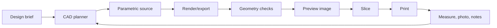

# Agentic CAD Stack

## Bet

Use a layered toolchain instead of one giant CAD application.

1. OpenSCAD for fast printable parametric objects.
2. CadQuery or build123d for precise Python CAD and STEP-grade mechanical parts.
3. FreeCAD command mode for visual CAD interop, STEP/B-rep workflows, repair, and occasional FEM.
4. Small geometry scripts for automated checks before slicing.
5. Manual slicer preview for now, later automated slicer checks where useful.

## Why This Stack

### OpenSCAD

Best for:

- Fast parameterized printable objects.
- Brackets, clips, spacers, adapters, trays, organizers, jigs.
- Agent-generated variants.
- Simple CLI export.

Limitations:

- Complex fillets and organic transitions are awkward.
- Mainly CSG/mesh-oriented.
- STEP/B-rep workflows are not its strength.

### CadQuery/build123d

Best for:

- Professional Python CAD.
- STEP export.
- More natural mechanical geometry than OpenSCAD.
- Agentic workflows because the source is plain Python.

Initial preference:

- Try build123d first for new work because it is modern and explicit.
- Keep CadQuery as a mature alternative with a large ecosystem.

### FreeCAD Command Mode

Best for:

- Import/export between STEP, STL, BREP, and FreeCAD documents.
- Geometry repair and inspection.
- Occasional scripted operations that need OpenCascade through FreeCAD.
- FEM experiments later.

Use the GUI only when visual interaction matters. The agent should prefer `FreeCADCmd.exe`.

## Local Tool Paths

- OpenSCAD: `C:\Program Files\OpenSCAD\openscad.exe`
- FreeCADCmd: `C:\Users\srilu\AppData\Local\Programs\FreeCAD 1.1\bin\freecadcmd.exe`
- Python: available as `python`

## Agentic Workflow

## First Automation Milestones

### Milestone 1: OpenSCAD Loop

- Generate `.scad`.
- Export STL and preview PNG.
- Check bounding box and manifold-style edge counts.
- Slice manually.
- Print and record results.

### Milestone 2: Python CAD Loop

- Add build123d or CadQuery environment.
- Generate `.py` model source.
- Export STEP and STL.
- Add dimension metadata.
- Compare generated bounding box with expected dimensions.

### Milestone 3: FreeCAD Interop Loop

- Use `FreeCADCmd.exe` to import STEP/STL.
- Export alternative formats.
- Run basic FreeCAD document creation scripts.
- Use FreeCAD GUI only for human inspection.

### Milestone 4: Evaluation Loop

- Create preview images from multiple angles.
- Run STL checks.
- Add clearance tables per material/profile.
- Store print results in `notes/`.

## MCP/Plugin Position

Do not wait for a special MCP before building. The useful control surface already exists:

- CLI commands.
- Text source files.
- Deterministic export scripts.
- Check scripts.
- Git history.

If a mature FreeCAD MCP becomes available later, it can wrap these same operations. It should not replace the script-first architecture.

